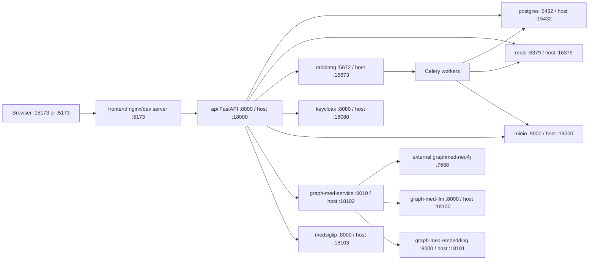
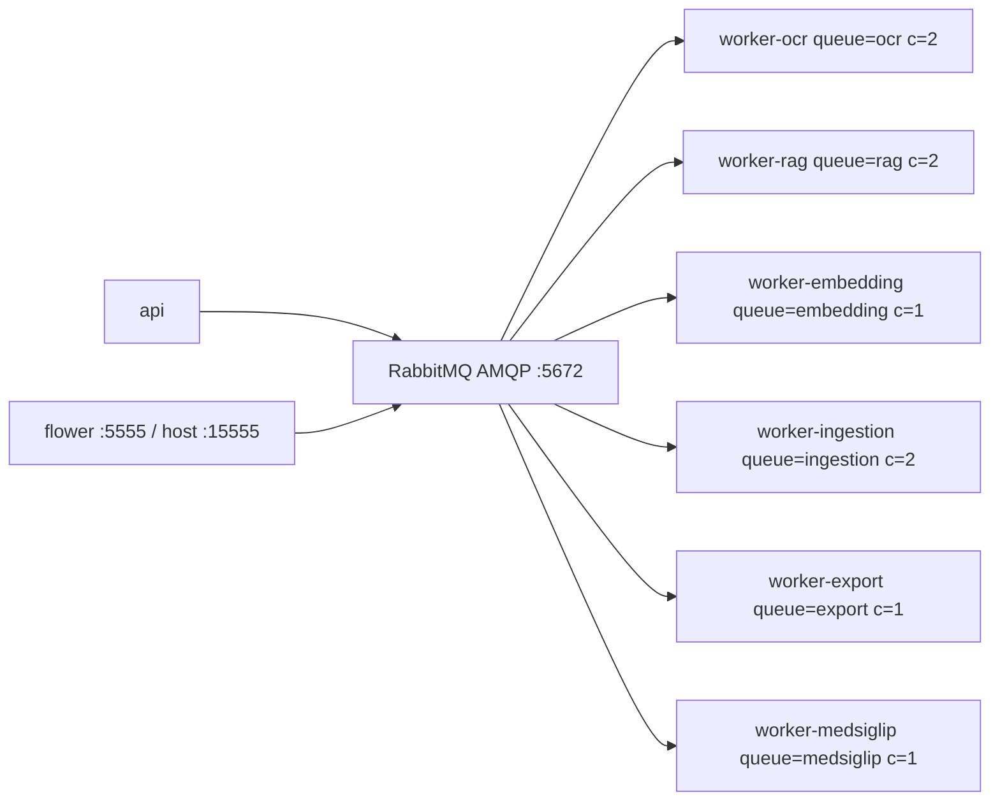

# OJTFlow Ports

Last checked: 2026-06-22. Source: `docker-compose.yml`, `.env.example`,
`infra/prometheus/prometheus.yml`, `frontend/nginx.conf`, and live `docker compose ps`.

## Ports To Keep Free

| Host | Env var | Service | Container | Purpose |
|---:|---|---|---:|---|
| 13000 | `OJT_GRAFANA_PORT` | `grafana` | 3000 | dashboards |
| 13100 | `OJT_LOKI_PORT` | `loki` | 3100 | logs |
| 15173 | Vite dev server | `frontend` dev | 5173 | web UI currently used at `http://localhost:15173` |
| 5173 | `OJT_FRONTEND_PORT` local override | `frontend` compose/dev | 5173 | alternate local UI port; current `.env` override |
| 15432 | `OJT_POSTGRES_PORT` | `postgres` | 5432 | PostgreSQL + pgvector |
| 15555 | `OJT_FLOWER_PORT` | `flower` | 5555 | Celery UI |
| 15672 | `OJT_RABBITMQ_MANAGEMENT_PORT` | `rabbitmq` | 15672 | RabbitMQ UI |
| 15673 | `OJT_RABBITMQ_AMQP_PORT` | `rabbitmq` | 5672 | AMQP broker |
| 16379 | `OJT_REDIS_PORT` | `redis` | 6379 | cache/rate limit |
| 18000 | `OJT_API_PORT` | `api` | 8000 | FastAPI |
| 18080 | `OJT_KEYCLOAK_PORT` | `keycloak` | 8080 | OIDC/auth |
| 18100 | `OJT_GRAPH_MED_LLM_PORT` | `graph-med-llm` | 8000 | vLLM MedGemma |
| 18101 | `OJT_GRAPH_MED_EMBEDDING_PORT` | `graph-med-embedding` | 8000 | vLLM embeddings |
| 18102 | `OJT_GRAPH_MED_SERVICE_PORT` | `graph-med-service` | 8010 | graph-med API |
| 18103 | `OJT_MEDSIGLIP_PORT` | `medsiglip` | 8000 | MedSigLIP API |
| 19000 | `OJT_MINIO_API_PORT` | `minio` | 9000 | S3 API |
| 19001 | `OJT_MINIO_CONSOLE_PORT` | `minio` | 9001 | MinIO UI |
| 19090 | `OJT_PROMETHEUS_PORT` | `prometheus` | 9090 | metrics |
| 19400 | `OJT_DCGM_EXPORTER_PORT` | `dcgm-exporter` | 9400 | GPU metrics |

`graph-med-service` owns host port `18102`. MedSigLIP defaults to `18103` so both
GPU services can be published at the same time.

External dependency observed running outside this compose file:

| Host | Service | Purpose |
|---:|---|---|
| 7475 | `graphmed-neo4j` | Neo4j browser, maps to container `7474` |
| 7688 | `graphmed-neo4j` | Neo4j Bolt, maps to container `7687` |

## Service Diagram



## Job Queue Pool



## Monitoring

```mermaid
flowchart LR
  Prom["prometheus :9090 / host :19090"] --> API["api /metrics :8000"]
  Prom --> RabbitExp["rabbitmq-exporter :9419"]
  Prom --> CeleryExp["celery-exporter :9808"]
  Prom --> NodeExp["node-exporter :9100"]
  Prom --> DCGM["dcgm-exporter :9400 / host :19400"]
  Grafana["grafana :3000 / host :13000"] --> Prom
  Promtail["promtail"] --> Loki["loki :3100 / host :13100"]
  Grafana --> Loki
```



## Internal-Only Ports

No host port required unless listed above:

| Endpoint | Purpose |
|---|---|
| `postgres:5432` | database |
| `redis:6379` | cache/rate limit |
| `rabbitmq:5672`, `rabbitmq:15672` | AMQP and management API |
| `minio:9000`, `minio:9001` | S3 API and console |
| `keycloak:8080`, `keycloak:9000` | auth and health |
| `api:8000` | backend |
| `frontend:5173` | frontend nginx |
| `graph-med-service:8010` | annotation API |
| `graph-med-llm:8000`, `graph-med-embedding:8000` | graph-med GPU endpoints |
| `medsiglip:8000` | image classification |
| `rabbitmq-exporter:9419`, `celery-exporter:9808` | metrics targets |
| `node-exporter:9100`, `dcgm-exporter:9400` | host/GPU metrics |
| `prometheus:9090`, `grafana:3000`, `loki:3100` | observability |

## API Modules On `18000`

`/health`, `/metrics`, `/api/v1/auth/*`, `/api/v1/assistant/*`,
`/api/v1/workflows/*`, `/api/v1/reviews/*`, `/api/v1/convert`,
`/api/v1/validate`, `/api/v1/fhir/*`, `/api/v1/interoperability/*`,
`/api/v1/ocr/*`, `/api/v1/parse/*`, `/api/v1/retrieval/*`,
`/api/v1/knowledge-graph/*`, `/api/v1/medsiglip/*`, `/api/v1/jobs/*`,
`/api/v1/artifacts/*`,
`/api/v1/runtime/*`, `/api/v1/governance/*`, `/api/v1/organizations/*`,
`/api/v1/audit/*`.

## Quick Check

```bash
ss -ltnp | grep -E ':(7475|7688|13000|13100|15173|5173|15432|15555|15672|15673|16379|18000|18080|18100|18101|18102|18103|19000|19001|19090|19400)\b'
docker compose --profile graph-med --profile medsiglip config --services
docker compose ps
```
