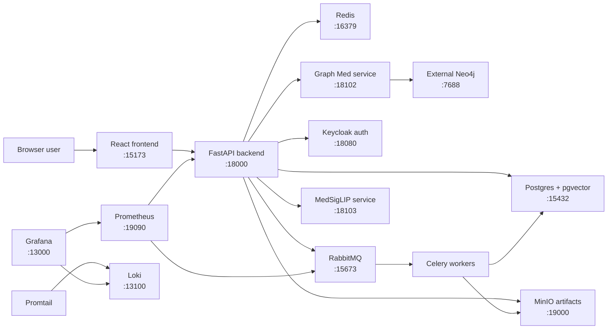
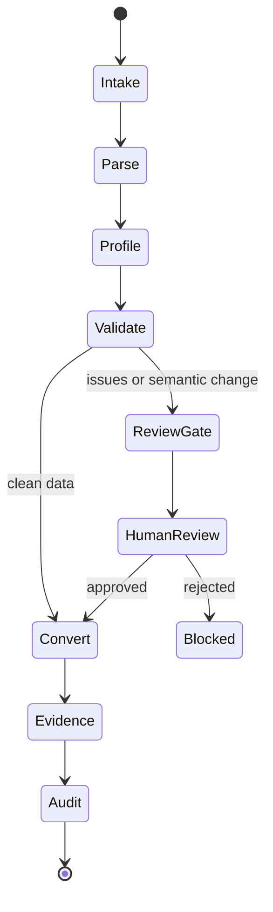
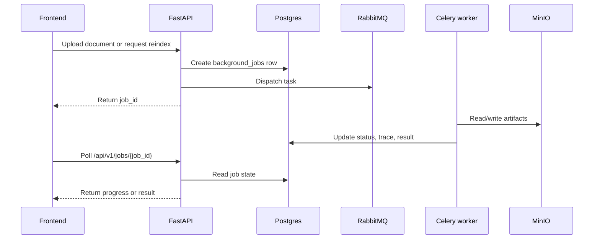
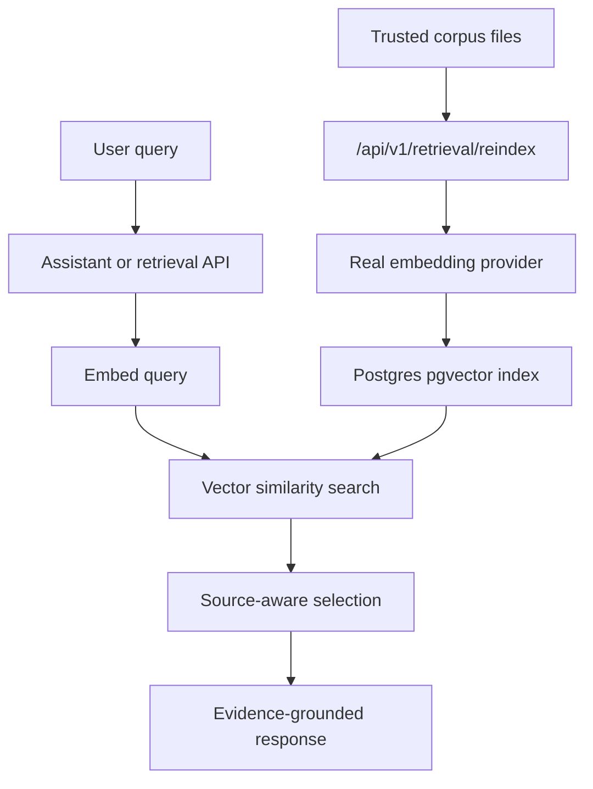

# OJTFlow

OJTFlow is a governed healthcare data workflow platform. It combines document
intake, validation, human review, retrieval, audit trails, background jobs, and
a React operations console on top of a FastAPI backend.

Use this README as the fast entry point. Deeper operational details live in
[PORT.md](PORT.md), [docs/testing_strategy.md](docs/testing_strategy.md), and
[docs/production_semantic_rag.md](docs/production_semantic_rag.md).

## Quick Start

Start the full Docker stack:

```bash
docker compose up -d --build
```

Start the queue and observability stack from the Makefile:

```bash
make queue-stack
```

Stop the repo Compose stack:

```bash
make queue-stack-down
```

Useful local URLs:

| Service | URL |
|---|---|
| Frontend | `http://localhost:15173` |
| API | `http://localhost:18000` |
| API health | `http://localhost:18000/health` |
| RabbitMQ UI | `http://localhost:15672` |
| Flower | `http://localhost:15555` |
| Grafana | `http://localhost:13000` |
| MinIO console | `http://localhost:19001` |

See [PORT.md](PORT.md) for the complete port map and collision checks.

## System Map



## Workflow Flow



## Async Job Flow



## Retrieval Flow



## Repo Layout

```text
src/ojtflow/
  core/             contracts, policies, errors
  application/      workflow, assistant, governance, retrieval use cases
  infrastructure/   Postgres, queues, retrieval, object storage, auth adapters
  interfaces/api/   FastAPI app and routes
frontend/
  src/              React operations console
sql/postgres/       ordered Postgres migrations
knowledge/          trusted schemas, rules, and corpus data
docs/               architecture, policy, testing, and release notes
```

Dependency direction points inward to `core`; API, storage, queues, auth,
retrieval, and model providers should remain replaceable behind ports.

## Common Commands

Run backend tests:

```bash
PYTHONDONTWRITEBYTECODE=1 PYTHONPATH=src python -m pytest
python scripts/evaluate-retrieval.py
```

Run the release check:

```bash
PYTHON_BIN=python scripts/release-check.sh
```

Run the API locally against Docker services:

```bash
docker compose up -d postgres redis rabbitmq minio
make api-local
```

Run the frontend locally:

```bash
cd frontend
npm install
npm run dev
```

Run browser E2E against the Docker stack:

```bash
cd frontend
npm run e2e
```

## Runtime Notes

- Production runtime storage is Postgres with pgvector.
- `OJT_STORAGE_BACKEND=memory` is for isolated tests only.
- Real semantic retrieval uses `OJT_EMBEDDING_PROVIDER=openai` or
  `OJT_EMBEDDING_PROVIDER=huggingface`; fake/hash/lexical providers are rejected
  for pilot and production modes.
- Uploaded files are stored as immutable artifacts, with extracted text stored
  as derived artifacts for review and workflow resume.
- OAuth uses Keycloak in Docker and can also support Google OAuth callbacks for
  local frontend/API development.
- Long-running OCR, parsing, retrieval, ingestion, export, and MedSigLIP work
  should run through RabbitMQ-backed Celery jobs.

## Main API Areas

| Area | Routes |
|---|---|
| Health and metrics | `/health`, `/metrics` |
| Auth | `/api/v1/auth/*` |
| Assistant | `/api/v1/assistant/*` |
| Workflows and reviews | `/api/v1/workflows/*`, `/api/v1/reviews/*` |
| Document parsing | `/api/v1/parse/*`, `/api/v1/ocr/*` |
| Retrieval | `/api/v1/retrieval/*`, `/api/v1/knowledge-graph/*` |
| Jobs and artifacts | `/api/v1/jobs/*`, `/api/v1/artifacts/*` |
| Runtime and governance | `/api/v1/runtime/*`, `/api/v1/governance/*`, `/api/v1/audit/*` |

## Reference Docs

- [PORT.md](PORT.md): ports, service diagrams, and quick collision checks.
- [docs/testing_strategy.md](docs/testing_strategy.md): test layers and release
  validation.
- [docs/production_semantic_rag.md](docs/production_semantic_rag.md): semantic
  retrieval setup and fail-fast behavior.
- [docs/auth_architecture.md](docs/auth_architecture.md): auth adapters,
  session storage, and browser session transport.
- [docs/document_parsing_uploads.md](docs/document_parsing_uploads.md): upload
  parsing, supported extensions, and artifact handling.
