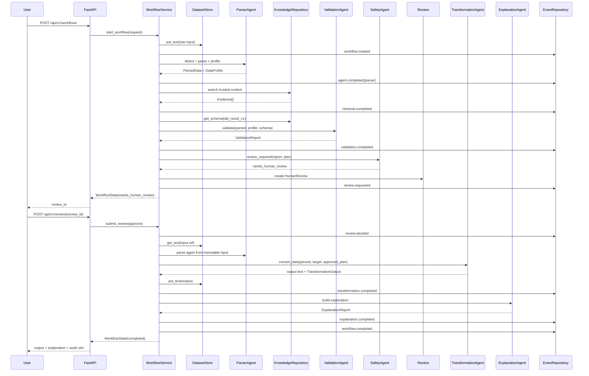

# Dataflow

This file describes how data moves through the system. It reflects the current scaffolded code and defines the standard flow for later RAG, MCP, OCR, DICOM, and vision extensions.

## Golden Dataflow

Main input:

```text
User instruction:
Clean this CSV, convert it to JSON, and explain anomalies.

Data:
data/fixtures/structured/lab_results_messy.csv
```

End-to-end flow:

```text
1. API receives the request.
2. WorkflowService creates WorkflowState.
3. DatasetStore stores raw input and hash.
4. ParserAgent detects format, parses CSV, and profiles data.
5. KnowledgeRepository returns trusted evidence and schema context.
6. ValidationAgent validates data against lab_result_v1.
7. TransformationPlan is created from validation issues.
8. SafetyAgent decides whether human review is required.
9. Workflow pauses at needs_human_review.
10. User approves through the review API.
11. WorkflowService reloads immutable input.
12. TransformationAgent converts CSV to JSON with a deterministic tool.
13. DatasetStore stores output and hash.
14. ExplanationAgent creates an explanation from evidence, report, and diff.
15. Workflow completes, with events and audit refs preserving the full trace.
```

## Sequence Diagram



## Data Artifacts By Step

| Step | Artifact created | Contract | Stored where |
| --- | --- | --- | --- |
| Create workflow | workflow ID, initial state | `WorkflowState` | `WorkflowRepository` |
| Store input | input hash, dataset ref | `DatasetRecord` | `DatasetStore` |
| Detect format | format/confidence/reasons | `FormatDetection` | workflow event metadata |
| Parse | parsed content, records, source rows | `ParsedData` | transient, derived from dataset ref |
| Profile | rows, fields, types, missingness, PHI flags | `DataProfile` | `WorkflowState.profile` |
| Retrieve | trusted evidence | `Evidence[]` | `WorkflowState.retrieved_context` |
| Validate | issue list, severity summary | `ValidationReport` | `WorkflowState.validation_report` |
| Plan | reviewable actions | `TransformationPlan` | `WorkflowState.transformation_plan` |
| Review | pending/decision payload | `HumanReview` | `WorkflowState.review` |
| Transform | output ref/hash/diff | `TransformationOutput` | `WorkflowState.output` |
| Explain | supported claims, flags, limitations | `ExplanationReport` | `WorkflowState.explanation` |
| Audit | append-only event IDs | `WorkflowEvent` | `EventRepository` |

## Data Ownership

| Data type | Owner | Rule |
| --- | --- | --- |
| Raw user input | `DatasetStore` | Store by reference and hash; do not copy into events |
| Current workflow truth | `WorkflowState` | One workflow has one state object |
| Long-running trace | `WorkflowEvent` | Append-only; never rewrite history |
| Derived report | validation/transformation/explanation contracts | Store in workflow state or report tables later |
| Trusted knowledge | `KnowledgeRepository` | Versioned and source-scoped |
| Human decision | `HumanReview` + event | Decision becomes evidence |

## Input Data Handling

Raw input is untrusted:

- It can contain malformed CSV.
- It can contain PHI-like fields.
- It can contain prompt-injection strings.
- It can contain schema drift.

Therefore:

- raw content is stored through `DatasetStore`
- event logs store refs, hashes, and summaries, not raw sensitive content
- parsed content is regenerated from the immutable input ref when resuming
- validation and policy run before transformation

## Output Data Handling

Generated output must be:

- deterministic
- validated where applicable
- stored with hash
- tied to the transformation plan
- tied to the review decision when review happened
- explained through evidence and reports, not model-only rationale

## Where RAG Fits In The Dataflow

Current:

```text
WorkflowService -> StaticKnowledgeRepository.search() -> Evidence[]
```

Future:

```text
WorkflowService
  -> Retrieval port
  -> hybrid lexical + vector retrieval
  -> reranker
  -> graph/context expansion
  -> Evidence[]
```

Important: retrieval returns evidence and context only. It does not mutate workflow state directly and does not execute transformations.

## Where MCP Fits In The Dataflow

Current:

```text
WorkflowService -> direct Python data_tools
```

Future:

```text
Agent -> ToolRegistry -> MCP client -> MCP server -> deterministic tool
```

An MCP server must preserve the same tool contract:

- typed input
- typed output
- permission scope
- audit event
- approval requirement

## Where Medical Multimodal Fits

OCR, DICOM, and visual outputs should become evidence objects:

```text
OCR page/box -> Evidence(source_type=ocr_box)
DICOM metadata -> Evidence(source_type=dicom_metadata)
Segmentation mask -> Evidence(source_type=image_mask)
Video track -> Evidence(source_type=video_track)
```

They should not create a parallel explanation system. The final explanation still uses `ExplanationReport`.

