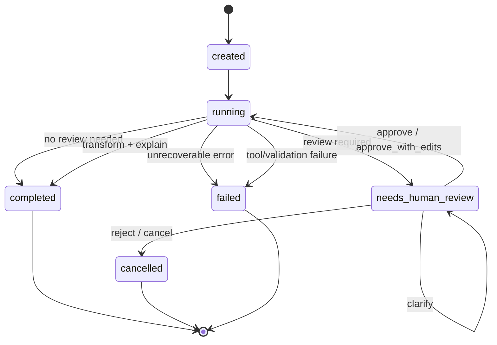

# Workflow State Machine

The workflow is the real backbone of the system. Agents, tools, RAG, MCP, OCR, and DICOM are all workflow steps. If the state machine is clear, the system can pause, resume, and audit. If the state machine is vague, modules will create separate paths and become hard to integrate.

## Status Values

| Status | Meaning |
| --- | --- |
| `created` | Workflow object exists but has not started |
| `running` | Workflow is processing |
| `needs_human_review` | Workflow is paused and waiting for user or clinician decision |
| `approved` | Review has approved the workflow to resume |
| `rejected` | Review rejected the proposed action |
| `completed` | Workflow finished successfully |
| `failed` | Workflow hit a non-recoverable error |
| `cancelled` | User or reviewer cancelled/rejected the workflow |

The current scaffold mainly uses `running`, `needs_human_review`, `completed`, and `cancelled`.

## State Transition



## Workflow Event Model

Events are the audit trail. Each event must include:

- `event_id`
- `workflow_id`
- `timestamp`
- `actor_type`
- `actor_id`
- `event_type`
- `severity`
- `summary`
- `input_refs`
- `output_refs`
- `metadata`

Events should not contain raw PHI or raw file content.

## Event Timeline For Golden Workflow

```text
workflow.created
agent.completed(parser_agent)
retrieval.completed
validation.completed
agent.completed(safety_agent)
review.requested
review.decided
transformation.completed
explanation.completed
workflow.completed
```

## Human Review Semantics

Human review is not a secondary UI popup. It is a first-class workflow state.

The review object contains:

- `review_id`
- `workflow_id`
- `status`
- `trigger`
- `question`
- `proposed_action`
- `allowed_decisions`
- `decision`
- `decision_payload`
- `decided_by`
- `decided_at`

Allowed decisions:

- `approve`
- `approve_with_edits`
- `reject`
- `clarify`
- `cancel`

## Review Trigger Rules

Review is required when:

- schema confidence is low
- multiple schema candidates exist
- a required healthcare field is missing
- date normalization is proposed
- missing values would be filled
- rows would be dropped
- semantic renaming is proposed
- unit conversion is proposed
- PHI-like or sensitive fields are found
- prompt-injection patterns are found
- retrieval evidence is weak or conflicting
- output may be medically consequential
- OCR confidence is low
- DICOM or visual evidence requires clinician check

## Pause And Resume Rule

When pausing:

1. Workflow status becomes `needs_human_review`.
2. `HumanReview` is attached to `WorkflowState.review`.
3. Event `review.requested` is appended.
4. API returns `review_id`.
5. No transformed output is created.

When resuming:

1. Review decision is recorded in `HumanReview`.
2. Event `review.decided` is appended.
3. If approved, workflow reloads raw input from `dataset_ref`.
4. Parser runs again to guarantee immutable input handling.
5. The approved plan executes.
6. Output, explanation, and audit events are created.

## API Behavior

| Endpoint | State effect |
| --- | --- |
| `POST /api/v1/workflows` | create workflow and run until review or completion |
| `GET /api/v1/workflows/{id}` | read current state |
| `GET /api/v1/workflows/{id}/events` | read event timeline |
| `POST /api/v1/review/{id}` | apply decision, resume or cancel |
| `POST /api/v1/convert` | direct deterministic conversion, no full workflow |
| `POST /api/v1/validate` | direct validation, no full workflow |

Direct endpoints are useful for tests and simple tools. The production user path should use the workflow endpoint.

## Failure Handling

Failures should be represented, not hidden.

Expected failure categories:

- parse error
- unsupported format
- schema missing
- validation critical issue
- tool execution failure
- policy blocked
- storage failure
- retrieval unavailable
- unsupported explanation claim

Recommended behavior:

- create `Issue` where possible
- append `workflow.failed` or `tool.failed`
- keep input hash/ref
- preserve events before failure
- expose a user-readable summary

## Idempotency And Retry

Important operations:

- parsing is idempotent
- profiling is idempotent
- validation is idempotent for the same schema/version/input
- conversion is idempotent for the same input/plan/target format
- review decisions are not freely repeatable; changing a decision should create a new event

Future production:

- add idempotency key for `POST /workflows`
- add workflow version/revision
- add optimistic locking for review decisions

## Invariants

These must always hold:

- A workflow has exactly one `workflow_id`.
- Every event references one workflow.
- Raw input is referenced by `dataset_ref` and `input_hash`.
- Transformation cannot run before validation.
- A review-required plan cannot transform before approval.
- Final explanation must refer to validation, evidence, or tool output.
- A completed workflow has output or a clear reason why output is absent.
- A cancelled workflow must not create transformed output after rejection.

