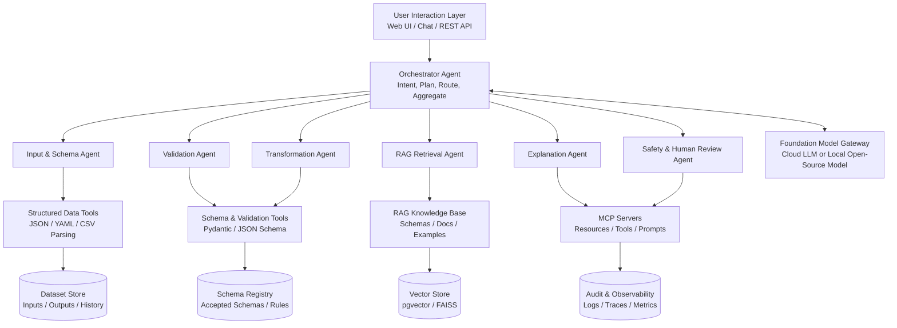

# OJTFlow

**A Foundation-Model, RAG, MCP, and Multi-Agent System for Structured Data Collaboration and Natural Language Interaction**

**Document type:** Comprehensive Project Proposal  
**Version:** Draft v0.1 - Research-backed working artifact  
**Prepared for:** HuReDee-IoYou AI OJT Program / Project Team Review  
**Date:** May 13, 2026

> **Purpose of this artifact:** This document is intended as a living proposal that can be refined through multiple review rounds. It combines the original structured-data multi-agent concept with a foundation model, retrieval-augmented generation, Model Context Protocol integration, and specialized AI agents. The proposal emphasizes practical implementation, deployability, evaluation, and safety.

# Document Outline

- 1. Executive Summary
- 2. Research Basis and Design Rationale
- 3. Problem Statement and Opportunity
- 4. Proposed Solution
- 5. System Architecture
- 6. Core Components and Agent Roles
- 7. RAG Design
- 8. MCP Integration Design
- 9. Foundation Model Strategy
- 10. Multi-Agent Workflow Scenarios
- 11. Technical Stack and API Design
- 12. Security, Governance, and Human-in-the-Loop Controls
- 13. Evaluation Plan
- 14. Implementation Roadmap
- 15. Expected Outcomes, Risks, and Future Extensions
- 16. References and Open Questions

# 1. Executive Summary

This proposal defines OJTFlow, a lightweight but extensible
multi-agent AI system for structured data collaboration and natural
language interaction. The system allows users to upload or provide JSON,
YAML, and CSV datasets, then ask natural language instructions such as
“Convert this CSV to JSON,” “Validate this schema,” “Explain the
dataset,” or “Clean this file and summarize key findings.”

The proposed system combines four modern AI architecture patterns:

- Foundation model layer: a cloud or locally hosted large language model
  interprets user intent, plans multi-step tasks, generates
  explanations, and coordinates reasoning-heavy interactions.

- Retrieval-augmented generation layer: RAG provides the model with
  task-specific context, including schema definitions, transformation
  policies, documentation, error examples, historical conversions, and
  approved templates.

- Model Context Protocol layer: MCP standardizes how agents access
  external tools, data resources, and prompts through well-defined
  servers, rather than hardcoding every integration.

- Multi-agent orchestration layer: specialized agents divide
  responsibility for parsing, schema inference, validation,
  transformation, retrieval, explanation, audit, and human approval.

The central design principle is to use the foundation model for language
understanding, planning, explanation, and decision support, while
deterministic tools handle data parsing, format conversion, schema
validation, and persistence. This separation improves reliability
because the system does not ask the model to “guess” structured outputs
when code-based tools can perform exact transformations.

The MVP will demonstrate a deployable, API-driven prototype using
Python, FastAPI, Pydantic, MCP Python SDK, a vector store such as
pgvector or FAISS, and a multi-agent orchestration framework such as
LangGraph or AutoGen. The result will be a practical AI data
collaboration platform suitable for demonstrations, technical
evaluation, and future product expansion.

# 2. Research Basis and Design Rationale

The proposal is grounded in research papers, official protocol
documentation, and widely used implementation frameworks. The following
findings are most relevant to this project.

| **Area**            | **Key research or documentation finding**                                                                                                                                                                                         | **Design implication for this project**                                                                                                                                                |
|---------------------|-----------------------------------------------------------------------------------------------------------------------------------------------------------------------------------------------------------------------------------|----------------------------------------------------------------------------------------------------------------------------------------------------------------------------------------|
| Foundation models   | Stanford CRFM defines foundation models as models trained on broad data, generally using self-supervision at scale, that can be adapted to many downstream tasks [R1].                                                          | Use a foundation model as the natural language interface, intent interpreter, planner, and explanation engine. Avoid using it as the only mechanism for deterministic data conversion. |
| RAG                 | The original RAG work combines parametric model memory with explicit non-parametric memory; it highlights provenance and updating knowledge as major limitations of model-only systems [R2].                                    | Build a knowledge base of schemas, transformation rules, examples, project documentation, and prior validated outputs so generated explanations can be grounded and traceable.         |
| MCP                 | MCP is an open protocol for connecting LLM applications with external data sources and tools, using JSON-RPC 2.0 and a host-client-server architecture [R3].                                                                    | Expose conversion, validation, retrieval, and audit functions as MCP tools/resources/prompts so agents can use standardized capabilities.                                              |
| MCP primitives      | MCP servers can expose tools, resources, and prompts; clients can support features such as sampling, roots, elicitation, logging, and progress tracking [R3, R4].                                                               | Implement separate MCP servers for structured-data tools, schema registry, RAG retrieval, and workflow audit. Use elicitation/human review patterns for risky actions.                 |
| Multi-agent systems | AutoGen research shows LLM applications can be built by composing multiple conversable agents that combine LLMs, human inputs, and tools [R5].                                                                                  | Use specialized agents and conversation/state transitions rather than one monolithic assistant.                                                                                        |
| Agent workflows     | LangGraph documentation emphasizes persistence, streaming, debugging, and deployment benefits for agents and workflows [R8].                                                                                                    | Use graph-based orchestration for traceable workflows and pausable human-in-the-loop interactions.                                                                                     |
| Human oversight     | LangChain HITL middleware can pause tool calls for approval, edit, rejection, or direct user response [R9].                                                                                                                     | Require human approval for destructive transformations, uncertain schema fixes, or actions that export/share data.                                                                     |
| Security            | OWASP identifies prompt injection, insecure output handling, training data poisoning, denial of service, supply chain risk, sensitive information disclosure, and insecure plugin design among top LLM application risks [R10]. | Build strict access controls, validation, prompt-injection defenses, audit logs, output sanitization, and least-privilege MCP tool scopes.                                             |
| Risk management     | NIST AI 600-1 provides a cross-sectoral companion profile to the AI Risk Management Framework for generative AI [R11].                                                                                                          | Include risk identification, evaluation, monitoring, documentation, and human accountability in the project plan.                                                                      |

## 2.1 Core Design Conclusion

The system should not be positioned as a simple JSON/YAML/CSV converter.
Instead, it should be positioned as an AI middleware and collaboration
layer for structured data. Its value comes from combining exact data
tooling with foundation-model reasoning, RAG grounding, MCP-based
interoperability, and multi-agent workflow control.

# 3. Problem Statement and Opportunity

## 3.1 Current Pain Points

Modern teams exchange structured data across APIs, internal tools,
spreadsheets, dashboards, and AI systems. However, the process is often
fragmented. Users may not know whether a file is valid, which schema it
follows, how to convert it safely, or how to interpret its meaning.
Developers and analysts also need repeatable conversion logic, not
one-off chatbot responses.

- Structured data conversion is often manual and error-prone when
  schemas are unclear.

- Non-technical users can struggle to understand JSON, YAML, and CSV
  structures.

- LLM-only systems may produce plausible but invalid structured outputs
  when not constrained by validation tools.

- Existing converters rarely provide reasoning, explanations, schema
  validation, or natural language control.

- Enterprise-style workflows require traceability, approvals, access
  control, logs, and integration with external tools.

## 3.2 Project Opportunity

OJTFlow addresses these pain points by becoming an intelligent
structured-data collaboration layer. It enables users to communicate
naturally while the system internally uses validated, deterministic
tools and multi-agent workflows to preserve correctness. This direction
is practical for OJT evaluation because it demonstrates backend
engineering, AI orchestration, system design, RAG, MCP, agentic
workflows, and deployment readiness.

# 4. Proposed Solution

## 4.1 Product Concept

OJTFlow is a deployable AI system that accepts structured
datasets, understands user instructions, routes work through specialized
agents, retrieves relevant knowledge, invokes tools through MCP,
validates outputs, explains results, and asks for human confirmation
when uncertainty or risk is high.

## 4.2 Primary Capabilities

- Natural language command interface for structured data tasks.
- Conversion between JSON, YAML, and CSV with schema preservation.

- Schema inference, schema validation, and data quality checks.
- RAG-grounded explanations of dataset meaning, fields, patterns, and
  transformation decisions.

- MCP tool servers for conversion, validation, retrieval, and audit
  functions.

- Multi-agent task planning and collaboration.
- Human-in-the-loop checkpoints for risky or ambiguous transformations.

- API endpoints and deployment-ready containerized architecture.

## 4.3 Non-Goals for the MVP

To keep the project realistic, the MVP should avoid overly broad data
analytics, autonomous enterprise system execution, and full fine-tuning.
The system can support foundation model APIs or local models, but model
training/fine-tuning should be treated as a future extension unless the
team has enough compute and time.

- No need for custom foundation model training in the MVP.
- No need for full enterprise workflow integration in the MVP.

- No need for multi-modal support in the MVP, although it can be listed
  as a future extension.

- No need for fully autonomous data modification without human approval.

# 5. System Architecture

The proposed architecture separates user interaction, orchestration,
agents, MCP tools, RAG storage, deterministic processing, and deployment
infrastructure. This makes the system modular and easier to extend.



*Figure 1. Proposed OJTFlow architecture combining foundation model, RAG, MCP, and multi-agent orchestration.*

## 5.1 Layered Architecture

| **Layer**                       | **Responsibility**                                                                                                       | **Recommended implementation**                                                              |
|---------------------------------|--------------------------------------------------------------------------------------------------------------------------|---------------------------------------------------------------------------------------------|
| User interaction layer          | Receives natural language instructions, file uploads, API requests, and human approval decisions.                        | React/Next.js or simple web UI; FastAPI REST endpoints; optional WebSocket progress stream. |
| Orchestrator layer              | Classifies intent, creates task plan, routes work to agents, handles state, aggregates results.                          | LangGraph for stateful graph workflows; AutoGen or CrewAI as alternatives.                  |
| Agent layer                     | Executes specialized responsibilities: parse, validate, transform, retrieve, explain, audit, and request human feedback. | Python classes or graph nodes; role-specific prompts; deterministic tools.                  |
| Foundation model gateway        | Provides natural language reasoning, explanation, planning, and summarization.                                           | Cloud LLM API or local model via Ollama/vLLM; model abstraction layer.                      |
| RAG layer                       | Retrieves relevant schemas, documentation, transformation examples, and project rules.                                   | Embeddings + vector store such as pgvector or FAISS; metadata filters.                      |
| MCP layer                       | Provides standardized access to tools, resources, and prompts.                                                           | MCP Python SDK / FastMCP servers with streamable HTTP for remote deployment.                |
| Data processing layer           | Performs exact parsing, conversion, validation, normalization, and persistence.                                          | Python json, csv, PyYAML, Pydantic, Pandas optional.                                        |
| Storage and observability layer | Stores datasets, outputs, histories, logs, traces, metrics, and approvals.                                               | PostgreSQL, SQLite for MVP, Redis for events, structured logs.                              |
| Deployment layer                | Runs system consistently across development and server environments.                                                     | Docker Compose for API, agents, MCP servers, database, vector store, and UI.                |

## 5.2 High-Level Data Flow

1. User submits a dataset and natural language instruction through UI
or API.

2. Orchestrator classifies task type: conversion, validation,
explanation, summarization, cleaning, or combined workflow.

3. Input & Schema Agent parses the dataset and infers structure.

4. RAG Retrieval Agent fetches relevant schemas, examples, policies,
and prior validated transformations.

5. Validation Agent checks syntax, types, schema consistency, missing
fields, and anomalies.

6. If ambiguity or risk is detected, Human Review Agent asks the user
to approve, edit, reject, or clarify the action.

7. Transformation Agent executes deterministic conversion or cleaning
through MCP tools.

8. Explanation Agent generates a grounded explanation using retrieved
context, validation results, and output metadata.

9. Safety & Audit Agent validates the final output, records logs, and
prepares response payload.

10. System returns converted data, validation report, explanation,
provenance, and optional downloadable output.

# 6. Core Components and Agent Roles

## 6.1 Agent Responsibilities

| **Agent**            | **Core responsibility**                                                                                      | **Inputs**                                         | **Outputs**                                          |
|----------------------|--------------------------------------------------------------------------------------------------------------|----------------------------------------------------|------------------------------------------------------|
| Orchestrator Agent   | Plans workflow, chooses agents, manages state, resolves dependencies, and aggregates final response.         | User request, dataset metadata, agent results.     | Task plan, agent calls, final response package.      |
| Input Parser Agent   | Detects format, parses JSON/YAML/CSV, extracts field names and sample values.                                | Raw file or text input.                            | Parsed data object, detected format, parsing errors. |
| Schema Agent         | Infers schema, compares against known schemas, identifies required/optional fields.                          | Parsed data, RAG schema context.                   | Schema profile, candidate schema, confidence score.  |
| Validation Agent     | Checks syntax, type consistency, missing values, duplicate keys, invalid rows, and schema violations.        | Parsed data, schema profile.                       | Validation report, issue list, severity levels.      |
| Transformation Agent | Executes JSON/YAML/CSV conversion, normalization, field mapping, and optional cleaning.                      | Validated data, task plan, transformation rules.   | Converted output, transformation diff, metadata.     |
| RAG Retrieval Agent  | Searches knowledge base for relevant project rules, examples, data dictionaries, and schema docs.            | User task, dataset fields, schema candidates.      | Retrieved context with source identifiers.           |
| Explanation Agent    | Generates human-readable summary of dataset, transformation, validation findings, and limitations.           | Output data, validation report, retrieved context. | Explanation, summary, caveats, suggested next steps. |
| Safety & Audit Agent | Checks policy compliance, prompt injection risk, output validity, sensitive data exposure, and logs actions. | User input, tool calls, outputs.                   | Audit log, safety flags, approval requirements.      |
| Human Review Agent   | Requests approval or clarification when actions are risky or ambiguous.                                      | Proposed action, issue report.                     | Approval, edit, rejection, or clarification.         |

## 6.2 Shared Agent State

All agents should operate on a shared workflow state object. This
prevents inconsistent interpretations and makes debugging easier. A
minimal state schema is shown below.

```json
{
  "workflow_id": "uuid",
  "user_instruction": "Convert this CSV to JSON and explain anomalies",
  "input_format": "csv",
  "target_format": "json",
  "parsed_data_ref": "storage://datasets/input-001",
  "schema_profile": {},
  "retrieved_context": [],
  "validation_report": {},
  "transformation_plan": {},
  "human_approval": null,
  "output_ref": null,
  "audit_events": []
}
```

## 6.3 Agent Communication Contract

Agent-to-agent communication should be structured rather than free-form.
Each agent response should contain:

- status: success, warning, error, needs_human_review
- summary: short natural language description

- data: structured payload
- confidence: numeric or categorical confidence

- issues: list of errors, warnings, or schema problems
- next_recommended_action: suggested next step for the orchestrator

# 7. RAG Design

## 7.1 Purpose of RAG in This Project

RAG should not be used only for answering documentation questions. In
this project, RAG should ground the foundation model in the team’s
approved schemas, transformation rules, examples, and project knowledge.
This gives agents relevant context at runtime and reduces dependence on
static model knowledge.

## 7.2 Knowledge Sources

| **Knowledge source**    | **Examples**                                                                     | **How it helps**                                                   |
|-------------------------|----------------------------------------------------------------------------------|--------------------------------------------------------------------|
| Schema documentation    | JSON Schema files, Pydantic models, CSV column definitions.                      | Improves schema matching and validation explanations.              |
| Transformation examples | Before/after conversions, approved YAML templates, CSV-to-JSON mapping examples. | Guides the model when explaining or planning transformations.      |
| Project documentation   | Architecture notes, API docs, OJT requirements, demo scripts.                    | Allows the system to answer project-specific questions.            |
| Error library           | Known parsing errors, malformed data examples, validation messages.              | Improves repair suggestions and user-facing explanations.          |
| Data dictionaries       | Column descriptions, field meanings, business terms.                             | Makes explanations more useful to non-technical users.             |
| Audit history           | Past accepted transformations and user approvals.                                | Supports “use the same schema as before” and improves consistency. |

## 7.3 Retrieval Pipeline

1. Ingest documents, schemas, examples, and transformation rules.

2. Chunk documents by semantic boundaries, preserving metadata such as
source, version, schema name, field names, and date.

3. Generate embeddings for text and schema descriptions.

4. Store vectors in pgvector or FAISS, with metadata filters for schema
type, data format, and project module.

5. At runtime, build retrieval query from user instruction, detected
dataset fields, target format, and validation issues.

6. Retrieve top-k relevant contexts, optionally rerank them, and pass
only necessary context to the model.

7. Require the Explanation Agent to cite or mention the retrieved basis
in internal trace metadata.

## 7.4 RAG Modes

| **Mode**    | **Description**                                                     | **Recommended use**                                                               |
|-------------|---------------------------------------------------------------------|-----------------------------------------------------------------------------------|
| 2-step RAG  | Retrieve first, then generate answer or explanation.                | Simple explanations, documentation Q&A, predictable latency.                      |
| Agentic RAG | Agent decides when and how to retrieve during a multi-step process. | Complex workflows such as cleaning, schema matching, and transformation planning. |
| Hybrid RAG  | Combines keyword search, metadata filters, and vector similarity.   | Schema retrieval where exact field names and semantic meaning both matter.        |

## 7.5 RAG Quality Controls

- Use metadata filters to avoid retrieving irrelevant schemas from
  unrelated domains.

- Store schema version and source information to prevent outdated
  transformations.

- Refuse or flag answers when retrieval confidence is low.
- Separate untrusted user-provided data from trusted system
  documentation to reduce prompt injection risk.

- Use deterministic validators after model-generated transformation
  plans.

# 8. MCP Integration Design

## 8.1 Role of MCP

MCP should be used as the standardized interface between the agent
system and external capabilities. Instead of embedding all tool logic
directly inside the orchestrator, each tool family can be exposed as an
MCP server. This makes the system more modular, easier to test, and more
compatible with future AI clients.

## 8.2 Proposed MCP Servers

| **MCP server**           | **Resources**                                                           | **Tools**                                                                       | **Prompts**                                                  |
|--------------------------|-------------------------------------------------------------------------|---------------------------------------------------------------------------------|--------------------------------------------------------------|
| structured-data-server   | Input/output dataset references; sample rows; detected format metadata. | parse_data, convert_json_yaml, convert_csv_json, convert_yaml_csv, export_file. | Transformation instructions, error explanation templates.    |
| schema-validation-server | Schema registry, Pydantic models, JSON Schema documents.                | infer_schema, validate_schema, compare_schema, detect_anomalies.                | Schema repair proposal prompt, validation summary prompt.    |
| rag-context-server       | Documentation chunks, data dictionaries, transformation examples.       | search_context, get_schema_docs, get_examples, rerank_context.                  | Grounded explanation prompt, citation-aware response prompt. |
| workflow-audit-server    | Workflow logs, approval history, transformation diffs.                  | record_event, fetch_history, generate_audit_report.                             | Audit summary prompt, reviewer handoff prompt.               |
| human-review-server      | Pending approval items, issue reports.                                  | request_approval, record_decision, update_plan.                                 | Clarification request prompt, approval request prompt.       |

## 8.3 Example MCP Tool Definitions

The following examples describe tool contracts at a conceptual level. Exact code can be implemented using the MCP Python SDK / FastMCP style.

```yaml
tool: convert_csv_to_json
input:
  csv_text: string
  orientation: records | columns
  schema: optional object
output:
  json_text: string
  row_count: integer
  warnings: list
```

```yaml
tool: validate_against_schema
input:
  data_ref: string
  schema_ref: string
output:
  valid: boolean
  issues: list
  severity_summary: object
```

```yaml
tool: search_transformation_examples
input:
  source_format: string
  target_format: string
  field_names: list
  query: string
output:
  matches: list
  confidence: float
```

## 8.4 MCP Security and Approval Principles

MCP tools can represent real actions and should be treated with caution.
Tool execution should follow least privilege and human approval for
actions that modify, export, delete, or disclose data. For the MVP, the
safest approach is to expose read-only resources by default and require
approval for file-writing or external API calls.

- Separate local STDIO development servers from production streamable
  HTTP servers.

- Never allow arbitrary code execution from user prompts.
- Whitelist tools available to each agent role.

- Validate all tool arguments with Pydantic before execution.
- Log every MCP tool call with workflow ID, user/session ID, input hash,
  output hash, and timestamp.

- Require approval for destructive operations, external network calls,
  or sensitive data export.

# 9. Foundation Model Strategy

## 9.1 Role of the Foundation Model

The foundation model acts as the reasoning and language layer, not as
the sole processor. It should interpret intent, plan the workflow,
generate user-friendly explanations, summarize validation results,
propose schema repairs, and help select tools. Exact conversion and
validation should be performed by deterministic code tools.

## 9.2 Model Deployment Options

| **Option**              | **Benefits**                                                           | **Trade-offs**                                                   | **Best use**                                    |
|-------------------------|------------------------------------------------------------------------|------------------------------------------------------------------|-------------------------------------------------|
| Cloud LLM API           | Strong reasoning, easier setup, no GPU maintenance.                    | Cost, data privacy considerations, dependency on provider.       | Early prototype and best demo quality.          |
| Local open-source model | Data control, offline operation, GPU-supported inference.              | Requires GPU resources and model optimization; quality may vary. | Deployment environment with data privacy needs. |
| Hybrid model gateway    | Routes simple tasks locally and complex tasks to stronger cloud model. | More engineering complexity.                                     | Future production-ready architecture.           |

## 9.3 Recommended MVP Strategy

Use a model gateway abstraction from the start. The MVP can begin with
one high-quality cloud model or one local model, but all code should
call a model interface rather than directly hardcoding provider-specific
logic. This keeps the architecture flexible and supports future
switching between providers or local inference engines.

## 9.4 Prompting Principles

- Keep system prompts role-specific and short.
- Pass structured context from RAG and validators rather than raw
  unbounded data.

- Require JSON-formatted planning outputs from the Orchestrator Agent.
- Use deterministic validation after every model-suggested plan.

- Make uncertainty visible to the user when schema confidence is low.

# 10. Multi-Agent Workflow Scenarios

## 10.1 Scenario A: JSON to YAML Conversion

1. User: “Convert this JSON to YAML and explain the structure.”

2. Input Parser Agent confirms valid JSON.

3. Schema Agent infers top-level fields and nested structures.

4. Transformation Agent calls MCP conversion tool.

5. Validation Agent checks that round-trip conversion preserves
structure.

6. Explanation Agent summarizes the dataset and conversion result.

7. Audit Agent records input hash, output hash, and conversion
metadata.

## 10.2 Scenario B: Messy CSV to Clean JSON with Human Review

1. User uploads CSV and asks: “Clean this data, convert it to JSON, and
summarize sales information.”

2. Input Parser Agent detects CSV and extracts sample rows.

3. Validation Agent detects missing values, inconsistent date formats,
and one malformed row.

4. RAG Retrieval Agent finds the approved sales schema and previous
cleaning rules.

5. Transformation Agent proposes cleaning plan: normalize dates, fill
missing region as unknown, drop malformed row, convert to
records-oriented JSON.

6. Human Review Agent asks the user to approve or edit the proposed
cleaning plan.

7. After approval, Transformation Agent executes conversion through MCP
tools.

8. Explanation Agent summarizes sales data, flags limitations, and
explains cleaning decisions.

9. Audit Agent records human approval and transformation diff.

## 10.3 Scenario C: Explain a Dataset Without Conversion

1. User: “Explain this dataset for a business user.”

2. Parser and Schema Agents profile the dataset.

3. RAG Retrieval Agent retrieves data dictionary entries and field
descriptions.

4. Explanation Agent produces a non-technical summary, field glossary,
possible use cases, and caveats.

5. Safety Agent checks for sensitive fields and warns if personally
identifiable information is detected.

## 10.4 Scenario D: Developer-Focused API Middleware

1. Developer sends API response JSON and asks for YAML configuration
format.

2. System detects nested API response format.

3. RAG retrieves YAML configuration examples and field-mapping rules.

4. Transformation Agent converts and validates output.

5. Explanation Agent provides a mapping table from source fields to
target configuration fields.

# 11. Technical Stack and API Design

## 11.1 Recommended Technology Stack

| **Category**        | **Recommended stack**                                                | **Reason**                                                                                         |
|---------------------|----------------------------------------------------------------------|----------------------------------------------------------------------------------------------------|
| Backend API         | Python + FastAPI                                                     | FastAPI is production-ready, Python-native, type-hint friendly, and integrates well with Pydantic. |
| Validation          | Pydantic + JSON Schema                                               | Strong schema validation, automatic JSON schema generation, API compatibility.                     |
| Data conversion     | Python json, csv, PyYAML; Pandas optional                            | Reliable deterministic parsing and conversion.                                                     |
| Agent orchestration | LangGraph preferred; AutoGen alternative                             | LangGraph supports stateful workflows; AutoGen is strong for multi-agent conversations.            |
| RAG/vector store    | pgvector for integrated database; FAISS for lightweight local search | Both are practical options depending on deployment needs.                                          |
| MCP                 | MCP Python SDK / FastMCP                                             | Official SDK supports building MCP servers, clients, resources, prompts, tools, and transports.    |
| Storage             | SQLite for MVP; PostgreSQL for deployment                            | SQLite is simple; PostgreSQL scales and works with pgvector.                                       |
| Messaging/events    | Redis optional                                                       | Useful for live workflow updates and asynchronous agent events.                                    |
| Frontend            | React/Next.js or Streamlit for MVP                                   | React for production-like UI; Streamlit for fast demo.                                             |
| Deployment          | Docker Compose                                                       | Defines and runs multi-container applications consistently.                                        |
| Observability       | Structured logs, LangSmith optional, OpenTelemetry future            | Needed for debugging agent decisions and tool calls.                                               |

## 11.2 Proposed API Endpoints

| **Endpoint**                  | **Method** | **Purpose**                                        | **Request body**                       | **Response**                         |
|-------------------------------|------------|----------------------------------------------------|----------------------------------------|--------------------------------------|
| /api/v1/workflows             | POST       | Start a multi-agent workflow.                      | instruction, input data/file, options. | workflow_id, initial status.         |
| /api/v1/workflows/{id}        | GET        | Fetch workflow status and final result.            | path parameter.                        | status, events, output, explanation. |
| /api/v1/workflows/{id}/events | GET/SSE    | Stream live agent progress.                        | path parameter.                        | event stream.                        |
| /api/v1/convert               | POST       | Direct conversion for simple tasks.                | source_format, target_format, data.    | converted data, warnings.            |
| /api/v1/validate              | POST       | Validate data against inferred or provided schema. | data, schema optional.                 | validation report.                   |
| /api/v1/explain               | POST       | Generate human-readable explanation.               | data, context options.                 | summary, field glossary, caveats.    |
| /api/v1/review/{id}           | POST       | Submit human approval/edit/rejection.              | decision, edited plan optional.        | updated workflow state.              |

## 11.3 Example Workflow Request

```http
POST /api/v1/workflows
```

```json
{
  "instruction": "Clean this CSV, convert it to JSON, and explain anomalies.",
  "input_format": "csv",
  "target_format": "json",
  "data": "date,region,sales\\n2026-01-01,APAC,1000\\n...",
  "options": {
    "require_human_review": true,
    "schema_name": "sales_report_v1",
    "output_orientation": "records"
  }
}
```

## 11.4 Example Workflow Response

```json
{
  "workflow_id": "wf_001",
  "status": "needs_human_review",
  "summary": "CSV parsed successfully. Three validation issues were found.",
  "proposed_action": {
    "normalize_dates": true,
    "fill_missing_region": "Unknown",
    "drop_malformed_rows": 1
  },
  "approval_url": "/api/v1/review/wf_001"
}
```

# 12. Security, Governance, and Human-in-the-Loop Controls

## 12.1 Key Risks

| **Risk**                         | **Why it matters**                                                                                  | **Mitigation**                                                                                                 |
|----------------------------------|-----------------------------------------------------------------------------------------------------|----------------------------------------------------------------------------------------------------------------|
| Prompt injection                 | User data or retrieved documents may contain hidden instructions that attempt to control the model. | Separate instructions from data, sanitize retrieved context, use system-level tool policies, validate outputs. |
| Insecure output handling         | LLM outputs may be passed to tools, files, or APIs without validation.                              | Validate all model outputs with schemas before execution. Never execute generated code directly.               |
| Sensitive information disclosure | Datasets may contain personal, confidential, or proprietary fields.                                 | PII detection, masking, access control, explicit approval before export.                                       |
| Excessive agency                 | Agents may perform unintended actions if given broad tool access.                                   | Least-privilege tools, approval gates, read-only defaults.                                                     |
| RAG poisoning                    | Untrusted documents may influence model responses.                                                  | Separate trusted and untrusted sources, metadata trust levels, retrieval filters.                              |
| MCP tool misuse                  | MCP exposes tools and resources that can perform actions.                                           | Whitelist tools, require user consent, audit every call, sandbox execution.                                    |
| Schema drift                     | Output may follow an old or incorrect schema.                                                       | Schema versioning, retrieval filters, validation against current schema.                                       |
| Cost and latency                 | Agentic workflows may call the model too often.                                                     | Cap model calls, use deterministic tools, cache retrieval and schema profiles.                                 |

## 12.2 Human-in-the-Loop Checkpoints

Human review should be triggered when the system proposes any action
that changes data semantics or carries operational risk. Examples
include dropping rows, filling missing values, modifying field names,
exporting data outside the system, invoking external APIs, or applying a
low-confidence schema match.

| **Trigger**               | **Review prompt**                                                                  | **Allowed decisions**                           |
|---------------------------|------------------------------------------------------------------------------------|-------------------------------------------------|
| Low schema confidence     | “The system found two possible schemas. Which one should be used?”                 | approve selected schema, edit, reject, clarify. |
| Data cleaning changes     | “The system proposes dropping 1 malformed row and normalizing date values.”        | approve, edit cleaning rule, reject.            |
| Sensitive fields detected | “Possible PII fields were found. Should they be masked before explanation/export?” | mask, keep with approval, reject export.        |
| External tool/API call    | “The workflow wants to call an external tool/server.”                              | approve, reject.                                |

## 12.3 Audit Requirements

- Record workflow ID, user/session, timestamp, action, tool name, input
  hash, output hash, and decision status.

- Store validation report and transformation diff for every completed
  workflow.

- Record human approvals and edits as part of workflow history.
- Expose audit summary in the final result for transparency.

# 13. Evaluation Plan

## 13.1 Evaluation Dimensions

| **Dimension**              | **Metric**                                                                                | **Target for MVP**                            |
|----------------------------|-------------------------------------------------------------------------------------------|-----------------------------------------------|
| Conversion correctness     | Exact structural equivalence after conversion; round-trip consistency where possible.     | >= 95% on curated test cases.                |
| Validation accuracy        | Correct detection of malformed records, missing fields, type mismatches, invalid schemas. | >= 90% on test suite.                        |
| RAG relevance              | Top-k retrieved context relevance judged by reviewers.                                    | >= 80% relevant in top 5.                    |
| Explanation quality        | Human rating for clarity, usefulness, and faithfulness.                                   | Average >= 4/5.                              |
| Agent workflow success     | Percentage of tasks completed without incorrect routing or stalled state.                 | >= 85% for MVP scenarios.                    |
| Human review effectiveness | Correctly triggers review for risky/ambiguous transformations.                            | No critical risky operation without review.   |
| Latency                    | End-to-end response time for simple conversion and complex workflow.                      | < 3 sec simple; < 15 sec complex demo case. |
| Security                   | Prompt injection and unsafe tool-call tests blocked or flagged.                           | No successful destructive/unapproved action.  |

## 13.2 Test Dataset Plan

- Valid JSON, YAML, and CSV examples for basic conversion.
- Nested JSON objects and arrays for YAML conversion.

- CSV files with missing values, malformed rows, quoted commas, numeric
  fields, date fields, and inconsistent column counts.

- Schema test cases with required fields, optional fields, enumerations,
  type mismatches, and duplicate keys.

- Prompt-injection test cases embedded inside CSV cells and
  documentation chunks.

- Business demo datasets such as sales reports, inventory tables, and
  API responses.

## 13.3 Demo Success Criteria

The final demonstration should show visible agent collaboration, not
only final output. The best demo scenario is a messy CSV file that
requires validation, RAG-grounded schema matching, human approval,
conversion to JSON, and explanation of results. This demonstrates the
full architecture: foundation model, RAG, MCP tools, multi-agent
orchestration, validation, and human-in-the-loop governance.

# 14. Implementation Roadmap

## 14.1 Phased Plan

| **Phase**                        | **Duration** | **Main tasks**                                                                                   | **Deliverables**                                                   |
|----------------------------------|--------------|--------------------------------------------------------------------------------------------------|--------------------------------------------------------------------|
| Phase 0: Research and design     | Week 1       | Finalize proposal, architecture, stack, MVP scope, datasets, evaluation criteria.                | Approved proposal, architecture diagram, backlog.                  |
| Phase 1: Core API and data tools | Weeks 2-3    | Build FastAPI service, parsing, conversion, validation, storage, simple endpoints.               | Working JSON/YAML/CSV conversion and validation API.               |
| Phase 2: Agent orchestration     | Weeks 3-4    | Implement orchestrator, agent state, parser/schema/validation/transformation/explanation agents. | Multi-agent workflow for conversion and explanation.               |
| Phase 3: RAG layer               | Weeks 4-5    | Build knowledge base, embeddings, vector store, retrieval agent, schema/docs retrieval.          | RAG-grounded explanations and schema matching.                     |
| Phase 4: MCP integration         | Weeks 5-6    | Expose conversion, validation, RAG, and audit functions as MCP servers/tools/resources.          | MCP-compatible tool layer and integration tests.                   |
| Phase 5: Human review and safety | Weeks 6-7    | Add approval workflow, policy checks, audit logs, prompt-injection tests, sensitive data checks. | HITL review UI/API and safety report.                              |
| Phase 6: UI, deployment, demo    | Weeks 7-8    | Build UI, Docker Compose deployment, documentation, demo script, final testing.                  | Deployable prototype, technical documentation, final presentation. |

## 14.2 MVP Backlog

- Backend conversion API for JSON/YAML/CSV.
- Pydantic-based validation and schema inference.

- Agent workflow state and orchestrator.
- RAG knowledge base with schemas and transformation examples.

- MCP server for conversion and validation tools.
- Human review endpoint for ambiguous cleaning plans.

- Simple UI with input/output/explanation panels and agent progress
  timeline.

- Docker Compose deployment.
- Test dataset suite and evaluation report.

## 14.3 Stretch Backlog

- Real-time WebSocket or SSE agent progress visualization.
- Schema registry with versioning and approval workflow.

- RAG citation display in explanations.
- Advanced anomaly detection and lightweight analytics.

- Integration with external databases or enterprise workflow systems
  through additional MCP servers.

- Local model inference using GPU-supported deployment.

# 15. Expected Outcomes, Risks, and Future Extensions

## 15.1 Expected Outcomes

- A working multi-agent AI prototype for structured data transformation
  and explanation.

- API endpoints for conversion, validation, explanation, workflow
  execution, and human review.

- RAG knowledge base for schemas, examples, and project documentation.
- MCP-compatible servers for structured data tools and retrieval
  resources.

- Human-in-the-loop approval flow for risky or ambiguous
  transformations.

- Deployment-ready Docker architecture.
- Technical documentation, test cases, and final demonstration scenario.

## 15.2 Project Risks and Mitigations

| **Risk**                 | **Impact**                                          | **Mitigation**                                                                                    |
|--------------------------|-----------------------------------------------------|---------------------------------------------------------------------------------------------------|
| Scope creep              | Team may attempt too many advanced features.        | Define MVP strictly; move analytics, multimodal, and enterprise integration to future extensions. |
| Unreliable model outputs | Invalid structured output or incorrect explanation. | Use deterministic tools for conversion and validators after model outputs.                        |
| RAG quality issues       | Wrong context may cause poor explanations.          | Use metadata filters, curated docs, retrieval evaluation, and low-confidence warnings.            |
| MCP complexity           | Protocol integration may consume development time.  | Start with one or two MCP servers; use direct Python tools first, then wrap as MCP.               |
| GPU or model constraints | Local model performance may be insufficient.        | Use model gateway; choose cloud model for demo if local inference is weak.                        |
| Security risk            | Prompt injection or tool misuse.                    | Least privilege, human approval, audit logs, and adversarial tests.                               |

## 15.3 Future Extensions

- Multi-modal data support for images, tables extracted from PDFs, and
  chart explanation.

- Autonomous task planning across enterprise tools through additional
  MCP servers.

- Domain-specific agents for finance, sales, healthcare, education, or
  DevOps.

- Fine-tuned models or adapters for schema explanation and
  transformation planning.

- Collaborative real-time data pipelines where multiple users and agents
  can review changes.

- Integration with GitHub, Google Drive, databases, dashboards, or
  workflow engines.

- Benchmark suite for agentic structured-data workflows.

# 16. References

| **ID** | **Reference**                                                                                                       | **URL**                                                                                                                                 |
|--------|---------------------------------------------------------------------------------------------------------------------|-----------------------------------------------------------------------------------------------------------------------------------------|
| R1     | Bommasani, R. et al. (2021). On the Opportunities and Risks of Foundation Models. Stanford CRFM.                    | https://crfm.stanford.edu/report.html                                                                                                   |
| R2     | Lewis, P. et al. (2020). Retrieval-Augmented Generation for Knowledge-Intensive NLP Tasks. arXiv / NeurIPS 2020.    | https://arxiv.org/abs/2005.11401                                                                                                        |
| R3     | Model Context Protocol Specification. Official MCP documentation, 2025-11-25 version.                               | https://modelcontextprotocol.io/specification/2025-11-25                                                                                |
| R4     | Model Context Protocol Architecture Overview. Official MCP documentation.                                           | https://modelcontextprotocol.io/docs/learn/architecture                                                                                 |
| R5     | Wu, Q. et al. (2023). AutoGen: Enabling Next-Gen LLM Applications via Multi-Agent Conversation. arXiv.              | https://arxiv.org/abs/2308.08155                                                                                                        |
| R6     | Microsoft Research. AutoGen publication page.                                                                       | https://www.microsoft.com/en-us/research/publication/autogen-enabling-next-gen-llm-applications-via-multi-agent-conversation-framework/ |
| R7     | LangChain Docs. Retrieval and RAG.                                                                                  | https://docs.langchain.com/oss/python/langchain/retrieval                                                                               |
| R8     | LangGraph Docs. Workflows and agents.                                                                               | https://docs.langchain.com/oss/python/langgraph/workflows-agents                                                                        |
| R9     | LangChain Docs. Human-in-the-loop middleware.                                                                       | https://docs.langchain.com/oss/python/langchain/human-in-the-loop                                                                       |
| R10    | OWASP Foundation. Top 10 for Large Language Model Applications.                                                     | https://owasp.org/www-project-top-10-for-large-language-model-applications/                                                             |
| R11    | NIST. Artificial Intelligence Risk Management Framework: Generative Artificial Intelligence Profile, NIST AI 600-1. | https://www.nist.gov/publications/artificial-intelligence-risk-management-framework-generative-artificial-intelligence                  |
| R12    | MCP Python SDK documentation.                                                                                       | https://modelcontextprotocol.github.io/python-sdk/                                                                                      |
| R13    | FastAPI documentation.                                                                                              | https://fastapi.tiangolo.com/                                                                                                           |
| R14    | Pydantic documentation: JSON Schema.                                                                                | https://pydantic.dev/docs/validation/latest/concepts/json_schema/                                                                       |
| R15    | Docker Docs. Multi-container applications with Docker Compose.                                                      | https://docs.docker.com/get-started/docker-concepts/running-containers/multi-container-applications/                                    |
| R16    | pgvector GitHub repository.                                                                                         | https://github.com/pgvector/pgvector                                                                                                    |

# 17. Open Questions for Future Refinement

These questions should be reviewed by the team before final
implementation decisions.

1. Which foundation model should be used for the first demo: cloud API,
local open-source model, or hybrid gateway?

2. Should the MVP use LangGraph, AutoGen, CrewAI, or a custom
lightweight orchestrator?

3. Should RAG storage use pgvector inside PostgreSQL or a standalone
FAISS index?

4. Which demo domain should be prioritized: sales analytics, API
integration, DevOps YAML configuration, or data cleaning?

5. How strict should human approval be for cleaning operations such as
filling missing values or dropping rows?

6. What schema examples and documentation can the team prepare for the
RAG knowledge base?

7. What is the target deployment server environment, and does it have
GPU support?

8. How should the team measure explanation quality: evaluator rubric,
user survey, or test cases?

# 18. Draft Decision Log

| **Decision area**    | **Draft recommendation**                                               | **Status**  |
|----------------------|------------------------------------------------------------------------|-------------|
| Project positioning  | AI middleware for structured data collaboration, not only a converter. | Recommended |
| Backend framework    | FastAPI.                                                               | Recommended |
| Validation framework | Pydantic + JSON Schema.                                                | Recommended |
| Agent orchestration  | LangGraph for MVP; AutoGen as research reference/alternative.          | To confirm  |
| MCP implementation   | MCP Python SDK / FastMCP.                                              | Recommended |
| RAG store            | pgvector if PostgreSQL is used; FAISS for lightweight local MVP.       | To confirm  |
| Human review         | Required for destructive, ambiguous, or low-confidence operations.     | Recommended |